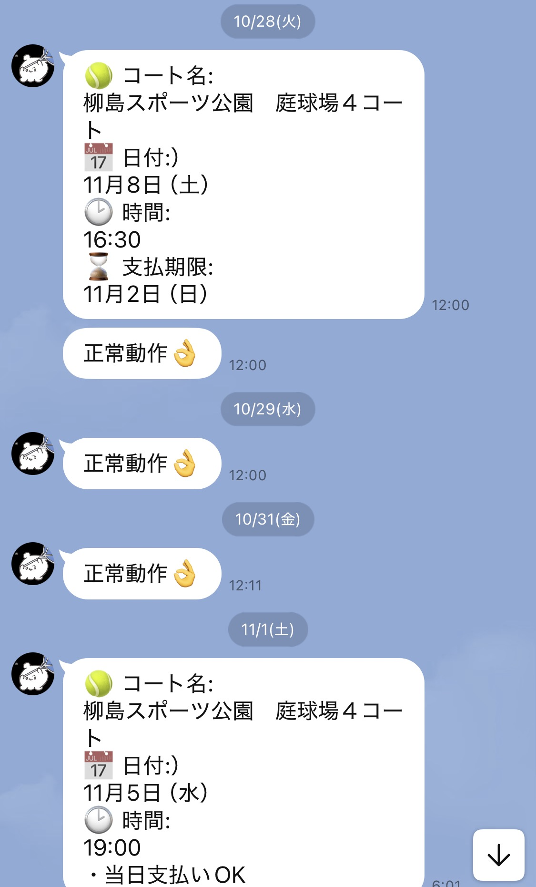

# 市営コート予約システム

市営テニスコート予約サイトに対して自動で指定日時の空きコートを取得・予約するJavaプログラムです。

---

### ⚙️ プログラム処理内容

1. 希望日時・コートを記入した CSV ファイルを読み取る  
2. 外部ファイルからログイン情報を読み取る  
3. 希望日時の枠が予約可能であれば予約処理を実施する  
4. 予約成功時、自分の LINE に完了メッセージを送信  
　（送信元は自作の公式 LINE アカウント）  
5. 一定間隔で上記処理を繰り返す  

> 運用上、**キャンセルによって空いた枠の取得を主目的**としているため、  
> このような仕様になっています。

---

### 🧩 主な技術構成

- **Java / Maven**
- **Jsoup**（HTML解析）
- **Apache HttpClient**（通信処理）
- **LaunchAgent (macOS)** による定期実行
- **LINE Notify API** による通知送信
- **独自の予約ルール**
  - 曜日別の除外コート設定（水曜・土日除外など）
  - 最大4時間制限
  - 時間帯の連続性判定

---

### 📁 外部ファイル構成

| ファイル名 | 用途 |
|-------------|------|
| `expectedDate.csv` | 希望日時・コートの一覧 |
| `credential.csv` | ログインID・パスワード |
| `lineToken.txt` | LINE通知用アクセストークン |
| `lineUserId.txt` | 通知先ユーザーID |
| `rootUrl.txt` | ルートURL（サイトアドレス） |

---

